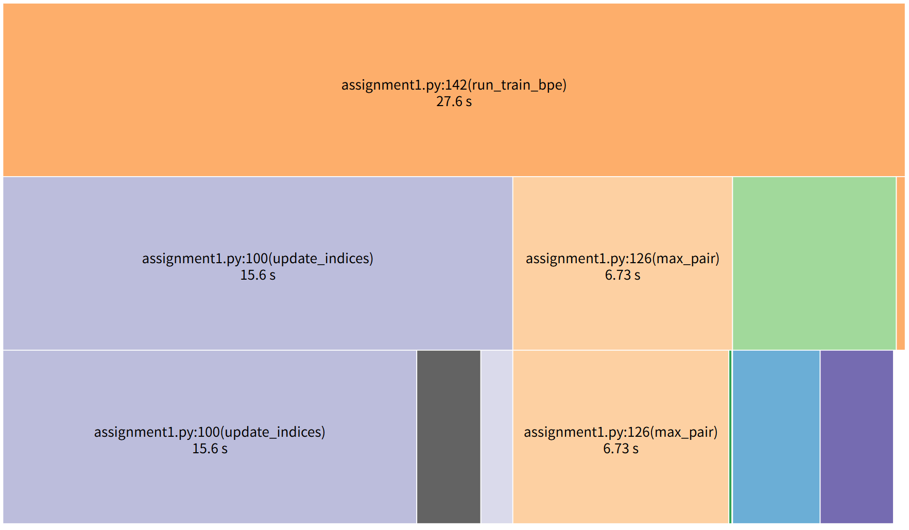
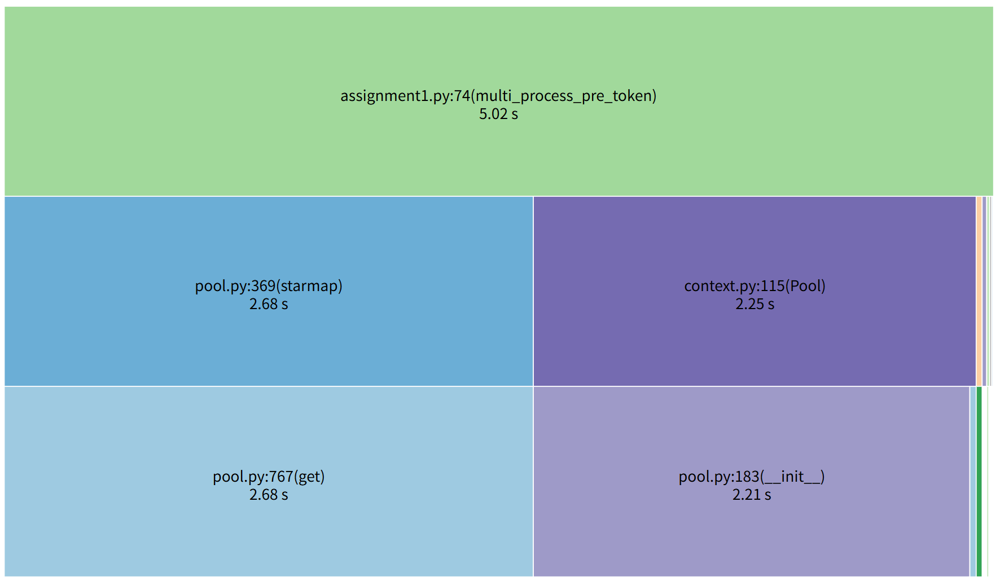
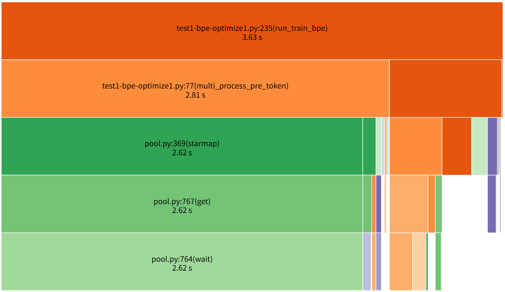
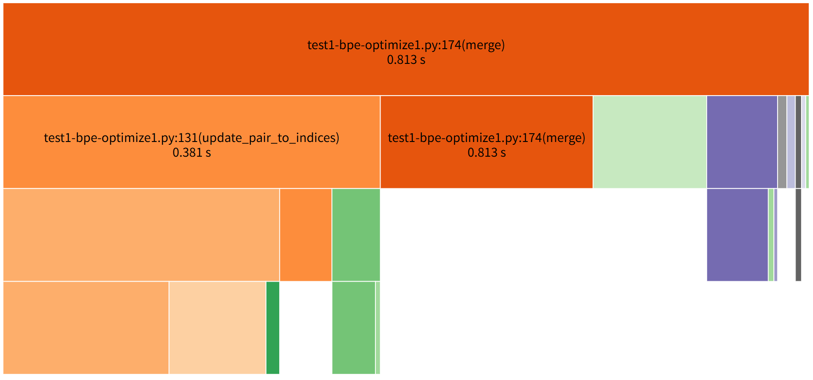
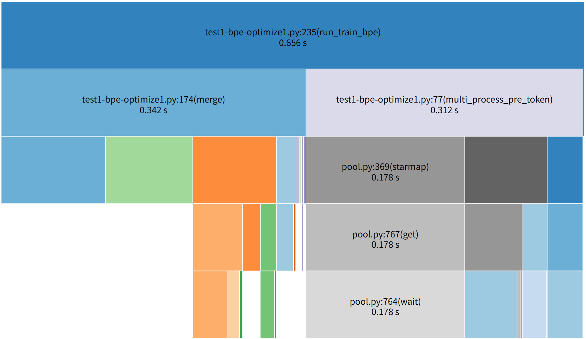
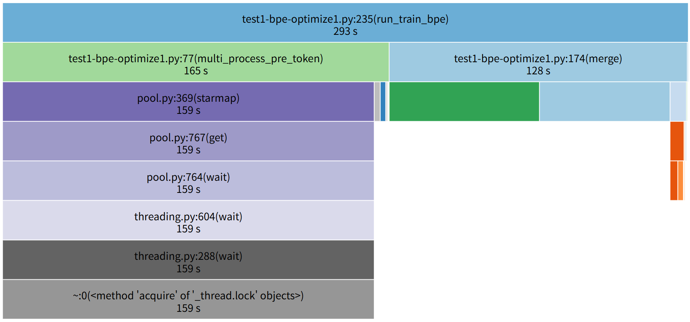
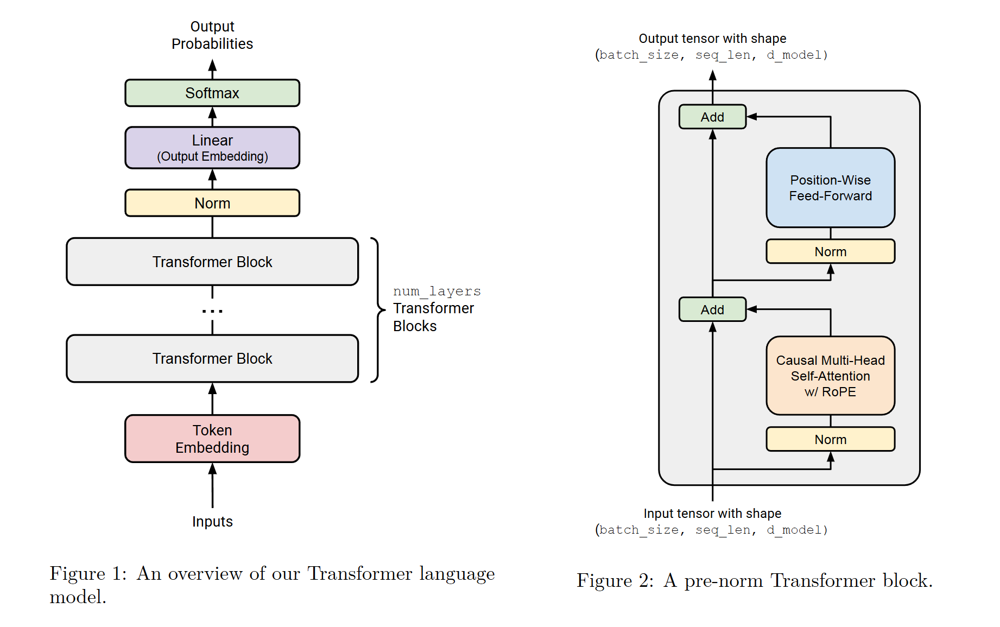

# Assignment 1: Building a Transformer LM
# 1 作业概述
从零开始构建训练一个标准 Transformer 语言模型（LM）所需的所有组件，并训练一些模型。  

## 1.1 你将实现
1. BPE 分词器
2. Transformer
3. 交叉熵损失函数和 AdamW 优化器
4. 支持模型与优化器状态序列化与加载的训练循环

## 1.2 你将运行
1. 在 TinyStories 数据集上训练一个 BPE 分词器。  
2. 用训练好的分词器将数据集转换为整数 ID 序列。  
3. 在 TinyStories 数据集上训练一个 Transformer 语言模型。  
4. 使用训练好的 Transformer LM 生成样本并评估困惑度（perplexity）。  
5. 在 OpenWebText 数据集上训练模型，并将你得到的困惑度提交到排行榜。  

## 1.3 工具
我们希望你从零实现这些组件。特别是，你不能使用 `torch.nn`、`torch.nn.functional` 或 `torch.optim` 中的任何定义，除了以下内容：  
- `torch.nn.Parameter`  
- `torch.nn` 中的容器类（如 `Module`、`ModuleList`、`Sequential` 等）  
- `torch.optim.Optimizer` 基类  

你可以使用 PyTorch 的其他定义。如果不确定某个函数或类是否允许使用，可以在 Slack 上询问。遇到不确定时，请考虑使用它是否会破坏“从零开始”的作业理念。  

允许使用大型语言模型（如 ChatGPT）来回答低层次的编程问题或关于语言模型的高层次概念问题，但禁止直接用它来解决作业中的问题。  我们强烈建议你在完成作业时**禁用** IDE 中的 AI 自动补全（如 Cursor Tab、GitHub Copilot），但允许使用非 AI 自动补全（例如函数名自动补全）。我们发现 AI 自动补全会使你更难深入理解作业内容。  

## 1.4 代码与提交
所有作业代码和作业说明都在 GitHub 仓库中：  
[github.com/stanford-cs336/assignment1-basics](https://github.com/stanford-cs336/assignment1-basics)  

请 `git clone` 该仓库，如果有更新，我们会通知你 `git pull` 获取最新版本。  

1. `cs336_basics/*`：你将编写代码的地方。注意，这里没有预先写好的代码，你可以完全从零开始。  
2. `adapters.py`：你的代码必须提供一组功能。对于每个功能（如缩放点积注意力），在 `adapters.py` 中的实现函数（如 `run_scaled_dot_product_attention`）里调用你写的代码即可。**注意**：你对 `adapters.py` 的修改不应包含实质性逻辑，它只是胶水代码。  
3. `test_*.py`：包含你必须通过的测试（如 `test_scaled_dot_product_attention`），这些测试会调用 `adapters.py` 中的钩子。**不要修改测试文件**。  

你需要向 Gradescope 提交以下文件：  
- `writeup.pdf`：回答所有书面问题，请用排版工具（如 LaTeX）编写。  
- `code.zip`：包含你编写的所有代码。  

要提交到排行榜，请向以下仓库提交 Pull Request：  
[github.com/stanford-cs336/assignment1-basics-leaderboard](https://github.com/stanford-cs336/assignment1-basics-leaderboard)  
排行榜提交的详细说明请参考仓库中的 `README.md`。  

## 1.5 数据集来源
本次作业将使用两个预处理好的数据集：  
- TinyStories（Eldan 和 Li，2023）  
- OpenWebText（Gokaslan 等人，2019）  

两个数据集都是单个的大型纯文本文件。  如果你是在课程中做作业，可以在任何非 head 节点机器的 `/data` 目录找到它们。如果你是在家跟做，可以用 `README.md` 中的命令下载它们。  

---

- 低资源/降规模提示（Init）
   在整个课程作业讲义中，我们会给出一些提示，帮助你在缺少 GPU 资源或没有 GPU 资源的情况下完成作业。例如，有时会建议缩小数据集或模型规模，或者解释如何在 MacOS 集成 GPU 或 CPU 上运行训练代码。  
   这些“低资源提示”会用蓝色方框标出。即使你是注册的斯坦福学生并有课程机器的访问权限，阅读这些提示也能帮助你更快迭代、节省时间。  

---

- 低资源/降规模提示：在 Apple Silicon 或 CPU 上运行作业 1  
   使用助教提供的参考代码，我们可以在一台配备 36 GB 内存的 Apple M3 Max 芯片上，在 **Metal GPU（MPS）** 模式下不到 5 分钟内训练出一个能够生成相对流畅文本的语言模型，用 CPU 训练则大约需要 30 分钟。  
   如果这些术语对你来说比较陌生，不必担心！只要你的笔记本电脑比较新、实现正确且高效，你就能训练出一个小型语言模型，生成简单儿童故事且流畅度不错。  
   作业后面会介绍如果你是在 CPU 或 MPS 上运行，需要做哪些调整。  

# 2 BPE Tokenizer

我们将训练并实现一个字节级的字节对编码（BPE）分词器 [Sennrich 等人，2016；Wang 等人，2019]。
我们会将任意（Unicode）字符串表示为一系列字节，并在这个字节序列上训练我们的 BPE 分词器。之后，我们会使用这个分词器将文本（字符串）编码成 tokens（整数序列）。

## 2.1 Unicode 标准
Unicode 是一种文本编码标准，用于将字符映射到整数码点。截至 Unicode 16.0（2024 年 9 月发布），该标准定义了 154,998 个字符，涵盖 168 种书写系统。
在 Python 中：
可以使用 ord() 函数将单个 Unicode 字符转换为它的整数表示；
可以使用 chr() 函数将整数 Unicode 码点转换为对应字符的字符串。
字符 “s” 的码点是 115（通常记作 U+0073，其中 U+ 是常规前缀，0073 是 115 的十六进制表示）。
字符 “牛” 的码点是 29275。
```python
print('Unicode: ', ord('s'), ord('牛'))
print('Character: ', chr(115), chr(29275))
```
> Unicode:  115 29275  
> Character:  s 牛

---

**Problem ：理解 Unicode（1 分）**

**(a)** chr(0) 返回的 Unicode 字符是什么？（一句话回答。）
```python
chr(0)
```
> '\x00'  
> '\x00'是十六进制的 `00` 的字节，表示的是一个空字符，'\x00' 是这个字符的 **字符串表示**（repr）

**(b)** 这个字符的字符串表示（`__repr__()`）与打印出来的表示有什么区别？（一句话回答。）
```python
chr(0).__repr__()
```
> "'\\x00'"

> 
**(c)** 当这个字符出现在文本中会发生什么？（一句话回答。）

```python
'this is a test' + chr(0) + 'string'
print('this is a test' + chr(0) + 'string')
```
> 'this is a test\x00string'  
> this is a teststring

## 2.2 Unicode 编码
虽然 Unicode 标准定义了从字符到码点（整数）的映射，但直接在 Unicode 码点上训练分词器并不现实，因为**词表会非常大**（大约 15 万个条目）且**稀疏**（很多字符非常少见）。因此，我们使用 Unicode 编码，它可以将一个 Unicode 字符转换为一系列字节。Unicode 标准本身定义了三种编码方式：UTF-8、UTF-16 和 UTF-32，其中 UTF-8 是互联网上的主流编码（占网页总数的 98% 以上）。

> UTF-8 是一种 Unicode 字符编码方式，它的作用是把字符（比如 a、牛、🌍）转换成 字节序列，方便计算机存储和传输。特点：
> 1. 可变长度
>    - ASCII 字符（0–127）用 1 个字节表示。（**ASCII 字符**：包括数字0-9，大小写英文字母，标点符号，空格，控制字符（如：空字符0-NUL，删除字符127-DEL））
>    - 其他字符用 2–4 个字节表示。例如："a" → 0x61（1 字节）；"牛" → 0xe7 0x89 0x9b（3 字节）；"🌍" → 0xf0 0x9f 0x8c 0x8d（4 字节）
> 
> 2. 向后兼容 ASCII
>    - 所有 ASCII 字符在 UTF-8 下编码结果和 ASCII 本身完全一致。
> 
> 3. 自我同步
>    - 可以通过字节的前几位轻松判断一个字符的开始和长度，不会破坏原来的文本结构。
> 
> 4. 用途广泛
>    - 是互联网最常用的编码方式（几乎所有网页和现代编程语言都支持）。
> 
> **总结一句话**：UTF-8 就是把 Unicode 字符映射成 1–4 个字节的规则，使文本既节省空间又兼容 ASCII。

要将 Unicode 字符串编码为 UTF-8，可以在 Python 中使用 encode() 函数。要访问 Python bytes 对象的底层字节值，可以对它进行迭代（例如使用 list()）。最后，我们可以使用 decode() 函数将 UTF-8 字节串解码回 Unicode 字符串。

```python
test_string = "hello! こんにちは!"
utf8_encoded = test_string.encode("utf-8")
print(utf8_encoded)
print(type(utf8_encoded))
print(utf8_encoded.decode("utf-8"))
```
>b'hello! \xe3\x81\x93\xe3\x82\x93\xe3\x81\xab\xe3\x81\xa1\xe3\x81\xaf!'  
><class 'bytes'>  
>hello! こんにちは! 

```python
print(list(utf8_encoded))
```
> [104, 101, 108, 108, 111, 33, 32, 227, 129, 147, 227, 130, 147, 227, 129, 171, 227, 129, 161, 227, 129, 175, 33]

```python
print(len(test_string))
print(len(utf8_encoded))
```
>13  
>23

通过把 Unicode 码点（codepoints）转换成字节序列（比如使用 UTF-8 编码），我们把原本的整数序列（每个整数代表一个字符，范围大约是 0 到 154,997）变成了 字节值序列（每个字节的整数范围是 0 到 255）。字节只有 256 种可能，比直接用 Unicode 码点的 15 万多个字符要容易管理得多。任何输入文本都可以表示为 0–255 的整数序列，因此不会出现模型训练时没见过的 token。

---

**Problem ：Unicode 编码 (3 分)**

(**a**) 为什么我们更倾向于在 UTF-8 编码的字节上训练分词器，而不是 UTF-16 或 UTF-32？(一句到两句的回答。)
提示：可以对比不同编码方式下相同输入字符串的输出结果。

| 编码方式    | 每个字符大小   | 是否变长 | 优缺点 |
| ---------- | ------------- | -------- | ----- |
| **UTF-8**  | 1–4 字节   | ✅ 是  | 高效，兼容 ASCII（英文最省空间），互联网最常用 |
| **UTF-16** | 2 或 4 字节 | ✅ 是  | 对中文较省空间，但实现复杂              |
| **UTF-32** | 固定 4 字节  | ❌ 否  | 简单，但极度浪费内存                 |

`Hello 🌍 你好` 在不同编码方式下的字节长度
- UTF-8：17 字节
- UTF-16（带 BOM）：24 字节
- UTF-32（带 BOM）：44 字节

对于相同字符串大小的输入：UTF-8 编码的字节长度最短，UTF-16/UTF-32 处理的是 码点（几十万种），或者至少要处理 65,536（2 字节）的组合，词表规模巨大，不利于高效训练。

(**b**) 考虑下面这个（错误的）函数，本意是将 UTF-8 字节串解码为 Unicode 字符串。请说明为什么它是错误的，并提供一个会导致错误结果的输入字节串。
```python
def decode_utf8_bytes_to_str_wrong(bytestring: bytes):
    return "".join([bytes([b]).decode("utf-8") for b in bytestring])
decode_utf8_bytes_to_str_wrong("hello".encode("utf-8"))
```
提交内容：给出一个会导致 decode_utf8_bytes_to_str_wrong 产生错误结果的输入字节串，并用一句话解释为什么这个函数是错误的。
> encode("utf-8")：str → bytes  
> decode("utf-8")：bytes → str

错误字符串："你好"。
错误原因：以上编码是按照一个字节一个字节编码的，但是有的字符比如：中文，表情符号是多个字节编码的。

(**c**) 给出一个不能解码为任何 Unicode 字符的两个字节序列。（一个示例，一句话解释原因）

举例：b'\xE4\xBD'。原因：UTF-8 编码中，两个字节的码点只有**部分**对应字符

> UTF-8 是一种 **可变长度编码**，每个字符使用 **1 到 4 个字节**表示。
> - 字节分配规则  
>    - 前缀位（如 `110`、`1110`）表示这是多字节的开头。
>    - 后续字节都以 `10` 开头，表示它们是延续字节。 
> | 字节数 | 码点范围         | 二进制格式                     | 说明 |
> |--------|----------------|--------------------------------|------|
> | 1      | U+0000 ~ U+007F | 0xxxxxxx                        | ASCII 字符，兼容旧系统 |
> | 2      | U+0080 ~ U+07FF | 110xxxxx 10xxxxxx               | 包含西欧及部分特殊符号 |
> | 3      | U+0800 ~ U+FFFF | 1110xxxx 10xxxxxx 10xxxxxx      | 常用汉字、日文、韩文 |
> | 4      | U+10000 ~ U+10FFFF | 11110xxx 10xxxxxx 10xxxxxx 10xxxxxx | 较少使用的辅助平面字符 |
> 
> - 编码示例，以汉字“**你**”（`U+4F60`）为例：
> 
>    1. 二进制码点：`0100 1111 0110 0000`（16 位）  
>    2. UTF-8 需要 3 个字节：  
>       - 按规则：`1110xxxx 10xxxxxx 10xxxxxx`  
>       - 填充二进制码点：
>      ```
>      11100100 10111101 10100000
>      ```  
>    - 转换为十六进制：`E4 BD A0`  

> - **ASCII 兼容**：0~127 的字符直接使用 1 字节，兼容老系统。  
> - **可变长度**：英文字符占 1 字节，汉字占 3 字节，节省存储空间。  
> - **自动同步**：UTF-8 的字节序列可以唯一识别字符边界，不易出错。

## 2.3 子词分词

虽然字节级分词可以缓解基于词的分词器遇到的“未登录词”（out-of-vocabulary, OOV）问题，但将文本分成字节会导致**输入序列非常长**。这会减慢模型训练速度：例如，一个包含 10 个单词的句子，在基于词的语言模型中可能只有 10 个 token，但在字符级模型中可能有 50 个或更多 token（取决于单词长度）。处理这些更长的序列会增加模型每一步的计算量。此外，对字节序列进行语言建模比较困难，因为更长的输入序列会在数据中产生长期依赖关系。

子词分词（subword tokenization）位于**词级分词器**和**字节级分词器**之间。注意，字节级分词器的词表只有 256 个条目（字节值为 0 到 255）。子词分词器通过**增加词表大小**来换取更好地压缩输入字节序列。例如，如果字节序列 b'the' 在训练文本中频繁出现，为其分配一个词表条目就可以把这个原本需要 **3** 个 token 的序列压缩为 **单个** token。

如何选择这些子词单元加入词表呢？Sennrich 等人 [2016] 提出使用 **字节对编码**（BPE, Byte-Pair Encoding; Gage, 1994），这是一种压缩算法，它通过迭代地将出现频率最高的 **字节对** 替换（“合并”）为一个新的、未使用的索引。需要注意的是，这个算法会把子词 token 加入词表，以 **最大化输入序列的压缩效果**——如果某个词在输入文本中出现足够多次，**它将被表示为单个子词单元**。

通过 BPE 构建词表的子词分词器通常称为 BPE 分词器。在本次作业中，我们将实现一个 **字节级** BPE 分词器，其词表条目为字节或字节序列的合并结果，这样既能处理未登录词，又能保持 **可管理的输入序列长度**。构建 BPE 分词器词表的过程被称为 **训练 BPE 分词器**。

## 2.4 BPE Tokenizer 步骤

BPE 分词器的训练过程主要包括三个步骤：

1. 词表初始化 (Vocabulary initialization)  
   分词器的词表是一一映射的结构：从字节串 token 到整数 ID。由于我们训练的是字节级 BPE 分词器，初始词表就是**所有可能的字节集合**。由于字节可能取值 0–255，因此初始词表大小为 256。

2. 预分词（Pre-tokenization）  
   一旦有了词表，就可以统计文本中相邻字节出现的频率，然后从最频繁的字节对开始合并。然而直接在整个语料上每次都统计相邻字节对非常耗费计算资源。此外，直接合并可能导致仅标点不同的 token 拥有不同的 ID（例如 dog! 和 dog.），而它们语义上可能非常相似。

   为避免这种情况，我们先**预分词**。可以把它理解为对语料的粗粒度分词，用于统计字符对出现的频率。例如，单词 text 作为一个预 token 出现 10 次，那么在统计字符 t 和 e 相邻出现次数时，可以直接增加 10 次，而不必遍历整个语料。由于是字节级 BPE，每个预 token 用 UTF-8 字节序列表示。

   Sennrich 等人 [2016] 的 BPE 原实现通过空格分词（s.split(" ")）进行预分词，而 GPT-2 使用的是基于正则的预分词器（Radford 等人, 2019）
   ```python
   import regex as re
   PAT = r"""'(?:[sdmt]|ll|ve|re)| ?\p{L}+| ?\p{N}+| ?[^\s\p{L}\p{N}]+|\s+(?!\S)|\s+"""
   re.findall(PAT, "some text that i'll pre-tokenize")
   ```
   >['some', ' text', ' that', ' i', "'ll", ' pre', '-', 'tokenize']
   
   > 这个正则表达式是 GPT-2 用于 **预分词（pre-tokenization）** 的规则，其作用是把文本拆成适合 BPE 训练的“预 token”。它的各部分含义如下：
   > ```regex
   > '(?:[sdmt]|ll|ve|re)       # 匹配英语缩写的结尾，例如 's, 'd, 'm, 't, 'll, 've, 're
   > | ?\p{L}+                  # 匹配一个或多个字母（Unicode 字母），前面可能有一个空格
   > | ?\p{N}+                  # 匹配一个或多个数字，前面可能有一个空格
   > | ?[^\s\p{L}\p{N}]+        # 匹配一个或多个非空白、非字母、非数字字符，前面可能有一个空格（通常是标点）
   > | \s+(?!\S)                # 匹配空格，但不包括非空白字符后面的空格
   > | \s+                      # 匹配一个或多个空白字符
   > ```
   在实际构建从预 token 到计数的映射时，应使用 re.finditer 避免保存所有预分词结果。关于 re.finditer 与 re.findall 的使用，在 `其他` 这一节有介绍。


3. 计算 BPE 合并（BPE merges）
   1. 将输入文本转换为预 token 并表示为 UTF-8 字节序列后，就可以计算 BPE 合并（即训练 BPE 分词器）。
   2. BPE 算法会迭代统计每对字节出现的次数，找到频率最高的字节对 (A, B)。
   3. 每次出现的该字节对都被合并为新的 token AB，并加入词表。
   4. 最终词表大小 = 初始词表大小（256）+ 合并操作次数。
   5. 为了训练效率，不考虑跨越预分词边界的字节对。  
      原始的 BPE 公式 [Sennrich 等人, 2016] 指定需要包含一个“单词结束”token。而在训练字节级 BPE 模型时，我们不添加单词结束 token，因为所有字节（包括空格和标点）都包含在模型的词表中。由于我们明确表示了空格和标点，学习到的 BPE 合并规则自然会反映这些单词边界。
   6. 若出现频率相同的字节对，按 **字典序** 选取较大的对进行合并，例如：
      ```python
      max([("A", "B"), ("A", "C"), ("B", "ZZ"), ("BA", "A")])
      ```
      > ('BA', 'A')

4. 特殊 token
   有些字符串（如 <|endoftext|>）用于编码元数据（如文档边界），通常希望这些字符串 **不被拆分**，保持为单个 token。因此需要将它们加入词表，并分配固定 ID。

**举个例子**： 


## 2.5 BPE Tokenizer 训练

第 1 节中有下载该数据集的说明，建议先浏览 TinyStories 数据集。  
第一节给的下载数据的方法没成功，用的以下方法：
```python
# 下载数据并保存
from datasets import load_dataset
ds = load_dataset("roneneldan/TinyStories")
ds.save_to_disk('../data/TinyStories')

# 然后再用下面的代码保存
text_train = "\n<|endoftext|>\n".join(p['text'].replace("\n\n", "\n") for p in dataset['train'])
text_valid = "\n<|endoftext|>\n".join(p['text'].replace("\n\n", "\n") for p in dataset['validation'])

# 写入到一个 txt 文件
with open("../data/TinyStoriesV2-GPT4-train.txt", "w", encoding="utf-8") as f:
    f.write(text_train)
with open("../data/TinyStoriesV2-GPT4-valid.txt", "w", encoding="utf-8") as f:
    f.write(text_valid)
```

1. 并行化预分词  
   你会发现预分词步骤是一个主要的瓶颈。可以通过使用内置库 `multiprocessing` 并行化代码来加速预分词。具体而言，我们建议在并行实现中，将语料**分块**（chunk），并确保分块边界出现在特殊 token 的开头。你可以直接使用以下链接提供的起始代码来获取分块边界，然后将工作分配到不同进程中。[pretokenization_example.py](https://github.com/stanford-cs336/assignment1-basics/blob/main/cs336_basics/pretokenization_example.py) （这个代码也在本项目的 `assignment1\cs336_basics\pretokenization_example.py` 中）
   这种分块方式总是有效的，因为我们从不希望跨文档边界合并 token。在作业中，你可以始终采用这种方式分块。无需担心遇到非常大的语料且不包含 `<|endoftext|>` 的边缘情况。

2. 在预分词前移除特殊 token　　
   使用正则模式（`re.finditer`）进行预分词之前，你应该从**语料**（如果使用并行实现的话就是**分块**）中剔除所有特殊 token。确保在特殊 token 处进行分割，这样它们之间的文本不会被合并。例如，如果语料（或分块）是 `[Doc 1]<|endoftext|>[Doc 2]`，你应该在特殊 token `<|endoftext|>` 处分割，并分别对 `[Doc 1]` 和 `[Doc 2]` 进行预分词，这样文档边界之间就不会发生合并。可以使用 `re.split` 并将 `"|".join(special_tokens)` 作为分隔符（注意使用 `re.escape` 处理特殊 token 中可能出现的 `|`）。测试 `test_train_bpe_special_tokens` 会验证这一点。

3. 优化合并步骤
   上面示例中的 BPE 训练的朴素实现速度较慢，因为每次合并时都需要遍历所有字节对来找出最频繁的字节对。然而，合并后只有与已合并字节对重叠的字节对的计数会发生变化。因此，可以通过对所有字节对计数进行索引，并增量更新这些计数，而不是显式地遍历每个字节对来计算频率，从而提高 BPE 训练速度。使用这种缓存方法可以显著加速训练，但需要注意，BPE 训练中的合并步骤在 Python 中无法并行化。

低资源/降规模技巧：
1. 性能分析（Profiling）    
   你应该使用性能分析工具（如 **cProfile** 或 **scalene**）来识别实现中的性能瓶颈，并重点优化这些部分。  

2. “降规模（Downscaling）”    
   在直接用完整的 **TinyStories** 数据集训练分词器之前，我们建议你先在一个较小的数据子集（即“调试数据集”）上进行训练。例如，你可以先在 TinyStories 的**验证集** 上训练，它只有 **2.2 万个文档**，而不是完整数据集的 **212 万个文档**。  

这说明了一种通用的“降规模”开发策略：在可能的情况下，使用更小的数据集、更小的模型规模等来加快开发。  
但要注意合理选择调试数据集的大小或超参数配置：  
- 调试集要足够大，以保证暴露出与完整配置相同的瓶颈，这样你做的优化才能推广  
- 但又不能太大，否则运行起来太耗时。 

---
 
**Problem ：BPE 分词器训练（15 分）**
**任务交付内容**：  
编写一个函数，给定输入文本文件路径，训练一个**字节级 BPE 分词器**。  
你的 BPE 训练函数应当至少支持以下输入参数：  
- **input_path: str**  
  输入文本文件的路径，用于 BPE 分词器训练数据。  
- **vocab_size: int**  
  一个正整数，定义最终词表的最大大小（包括初始字节词表、合并生成的词表项，以及所有特殊 token）。  
- **special_tokens: list[str]**  
  一个字符串列表，指定要加入词表的特殊 token。这些特殊 token 不会影响 BPE 训练过程.

你的 BPE 训练函数应返回以下结果：  
- **vocab: dict[int, bytes]**  
  分词器词表，一个从 `int`（词表中的 token ID）映射到 `bytes`（token 字节序列）的字典。  
- **merges: list[tuple[bytes, bytes]]**  
  BPE 训练过程中产生的合并操作列表。每个列表元素是一个字节对 **`(<token1>, <token2>)`**，表示 `<token1>` 与 `<token2>` 被合并。这些合并操作必须**按照生成顺序排列**。  

**测试方法**：  
要用我们提供的测试来检验你的 BPE 训练函数，首先需要在 **[adapters.run_train_bpe]** 中实现测试适配器。  
然后运行：`uv run pytest tests/test_train_bpe.py` 。你的实现应能通过所有测试。

**可选**（这可能需要大量时间），可以使用某些系统语言（例如C++（可考虑使用cppyy）或Rust（使用PyO3）来实现训练方法的关键部分。如果这样做，请注意哪些操作需要复制，哪些可以直接从Python内存中读取，并确保提供构建说明，或确保仅使用pyproject.toml即可构建。  
另外请注意，GPT-2的正则表达式在大多数正则表达式引擎中支持不佳，在支持的引擎中也大多速度过慢。我们已经验证Oniguruma速度合理且支持负向先行断言，但Python中的regex包甚至更快

---
**解答**
下面是包含注释且比较好看懂的版本： `run_train_bpe()` 的代码，这个是没有进行优化的，在测试中 `test_train_bpe_speed()` 测试没有通过，其它两项是可以通过的
使用这段代码在 `TinyStoriesV2-GPT4-valid.txt` 上进行测试，词表大小设置为500，程序运行总时长33.7s，各部分函数占用时间如下图：


```python
import os
import regex as re
from collections import defaultdict

def update_indices(
    indices: dict[tuple[int, ...], int], 
    pair: tuple[int, int], 
) -> defaultdict[tuple[int, ...], int]:
    '''
    更新 indices 序列的函数
    '''
    new_indices = defaultdict(int)
    for index in indices:
        new_index = []
        index_value = indices[index]
        i = 0
        while i < len(index):
            # i + 1 < len(index) 是用来保证 i 指向的是列表中的第二个 index
            # index[i] == pair[0] and index[i + 1] == pair[1] ：指定的 token 对 pair
            if i + 1 < len(index) and index[i] == pair[0] and index[i + 1] == pair[1]:
                new_index.append(pair[0] + pair[1])
                i += 2
            else:
                # 没有被指定 pair 对的时候，将原来index中的indice直接添加到new_index
                new_index.append(index[i])
                i += 1
        new_indices[tuple(new_index)] = index_value

    return new_indices


def pre_count_indices(
    content: str, 
    special_tokens: list
    ) -> defaultdict[tuple[int, ...], int]:
    '''
    对文档进行预分词
    '''
    # 按照特殊 tokens 分割文档
    texts = re.split("|".join(map(re.escape, special_tokens)), content)
    # 预分词规则：gpt2 的分词规则
    # 就这个正则化的错误让我改了一天的bug
    # PAT = r"""'(?:[sdmt]|ll|ve|re)| ?\p{{L}}+| ?\p{{N}}+| ?[^\s\p{{L}}\p{{N}}]+|\s+(?!\S)|\s+"""
    PAT = r"""'(?:[sdmt]|ll|ve|re)| ?\p{L}+| ?\p{N}+| ?[^\s\p{L}\p{N}]+|\s+(?!\S)|\s+"""
    # 对每个文档中的每个部分进行统计
    pre_indices = defaultdict(int)
    for text in texts:
        # 关于 re.finditer() 的使用在 `assignment.md` 中的 `其他` 部分有介绍
        pre_token_matches = re.finditer(PAT, text)
        # 统计分词出现的的次数
        for pre_token_matche in pre_token_matches:
            pre_indices_key = tuple([bytes([x]) for x in tuple(pre_token_matche.group().encode())])
            pre_indices[pre_indices_key] += 1
    return pre_indices


def max_pair(
    indices: defaultdict[tuple[int, ...], int]
    )-> tuple:
    '''
    找出出现次数最多的 pair
    '''
    counts = defaultdict(int)  # 用来计数的字典
    for index in indices:
        # 生成相邻两个 token 的组合（index1, index2）
        for index1, index2 in zip(index, index[1:]):
            counts[(index1, index2)] += indices[index]
    max_val = max(counts.values())  # 出现次数最多
    pair = max([k for k, v in counts.items() if v == max_val])  # 字典序最大
    
    return pair


def run_train_bpe(
    input_path: str | os.PathLike,
    vocab_size: int,
    special_tokens: list[str],
    **kwargs,
) -> tuple[dict[int, bytes], list[tuple[bytes, bytes]]]:
    """
    给定输入语料的路径，训练一个 BPE 分词器，并输出其 vocab 和 merges 。
    参数：
        input_path (str | os.PathLike)：BPE 分词器训练数据的路径。
        vocab_size (int)：分词器词表的总大小（包括特殊 token）。
        special_tokens (list[str])：一个字符串列表，表示要加入词表的特殊 token。
            这些特殊 token 永远不会被拆分成多个 token，总是保持为一个整体。
            如果这些特殊 token 出现在 `input_path` 中，它们会被视作普通字符串处理。
    返回：
        tuple[dict[int, bytes], list[tuple[bytes, bytes]]]：
            vocab：
                训练得到的分词器词表，字典的 key 是 int 结构（词表中的 token ID），
                value 是 bytes（对应的 token 字节串）。
            merges：
                BPE 合并规则。列表中的每一项是一个 bytes 元组 (<token1>, <token2>)，
                表示 <token1> 和 <token2> 被合并为一个新 token。合并规则按创建顺序排列。
    """
    
    # 1. 初始化: 256个基础词、特殊 tokens
    vocab: dict[int, bytes] = {x: bytes([x]) for x in range(256)}
    merges: list[tuple[bytes, bytes]] = []
    # 256个基础词，0-255，所以下一个是256
    next_token_id = 256
    # 将特殊 tokens 转换成 byte 格式并加入词表
    for special_token in special_tokens:
        # 注意这里所给的特殊 tokens 为 str 格式，vocab 中的是字节形式的
        vocab[next_token_id] = special_token.encode("utf-8")
        next_token_id += 1

    # 2. 预分词
    # 读取数据
    with open(input_path, "r", encoding="utf-8") as f:
        content = f.read()
    indices = pre_count_indices(content, special_tokens)

    # 3. BPE 合并
    # 合并次数为词表大小减去初始化的词表
    num_merges = vocab_size - 256 - len(special_tokens)
    for i in range(num_merges):
        # 找出出现次数最多的 pair
        pair = max_pair(indices)
        # merges 更新
        merges.append(pair)
        # 词表更新。将两个字节相加：不是数值相加，是两个字节拼接到一起
        vocab[next_token_id] = pair[0] + pair[1]
        next_token_id += 1
        # indices 序列更新
        indices = update_indices(indices, pair)

    return vocab, merges
```

接下来是优化后的代码：
1. 预分词阶段并行化
   进行预分词阶段并行化后，线程数设置为 4，代码的运行时长为：
   
   其中
   
2. 优化合并步骤
   对所有字节对计数进行索引，并增量更新这些计数。线程数设置为 4，代码的运行时长为：
   
   其中
   

这部分的代码在 `test1_bpe_optimize1.py` 文件中
```python
import os
import regex as re
from collections import defaultdict,Counter
from multiprocessing import Pool
from typing import BinaryIO
import cProfile

def find_chunk_boundaries(
    file: BinaryIO,
    desired_num_chunks: int,
    split_special_token: bytes,
) -> list[int]:
    """
    Chunk the file into parts that can be counted independently.
    May return fewer chunks if the boundaries end up overlapping.
    """
    assert isinstance(split_special_token, bytes), "Must represent special token as a bytestring"

    # Get total file size in bytes
    file.seek(0, os.SEEK_END)
    file_size = file.tell()
    file.seek(0)

    chunk_size = file_size // desired_num_chunks

    # Initial guesses for chunk boundary locations, uniformly spaced
    # Chunks start on previous index, don't include last index
    chunk_boundaries = [i * chunk_size for i in range(desired_num_chunks + 1)]
    chunk_boundaries[-1] = file_size

    mini_chunk_size = 4096  # Read ahead by 4k bytes at a time

    for bi in range(1, len(chunk_boundaries) - 1):
        initial_position = chunk_boundaries[bi]
        file.seek(initial_position)  # Start at boundary guess
        while True:
            mini_chunk = file.read(mini_chunk_size)  # Read a mini chunk

            # If EOF, this boundary should be at the end of the file
            if mini_chunk == b"":
                chunk_boundaries[bi] = file_size
                break

            # Find the special token in the mini chunk
            found_at = mini_chunk.find(split_special_token)
            if found_at != -1:
                chunk_boundaries[bi] = initial_position + found_at
                break
            initial_position += mini_chunk_size

    # Make sure all boundaries are unique, but might be fewer than desired_num_chunks
    return sorted(set(chunk_boundaries))

def pre_count_indices(
    content: str, 
    special_tokens: list
    ) -> defaultdict[tuple[int, ...], int]:
    '''
    对输入的文档进行预分词
    '''
    # 按照特殊 tokens 分割文档
    texts = re.split("|".join(map(re.escape, special_tokens)), content)
    PAT = r"""'(?:[sdmt]|ll|ve|re)| ?\p{L}+| ?\p{N}+| ?[^\s\p{L}\p{N}]+|\s+(?!\S)|\s+"""
    # 对每个文档中的每个部分进行统计
    pre_indices = defaultdict(int)
    for text in texts:
        # 关于 re.finditer() 的使用在 `assignment.md` 中的 `其他` 部分有介绍
        pre_token_matches = re.finditer(PAT, text)
        # 统计分词出现的的次数
        for pre_token_matche in pre_token_matches:
            pre_indices_key = tuple([bytes([x]) for x in tuple(pre_token_matche.group().encode())])
            pre_indices[pre_indices_key] += 1
    
    
    return pre_indices

def multi_process_pre_token(input_path, num_processes, special_tokens):
    '''
    并行化预分词阶段
    '''
    # 首先将文本分段
    chunks = []
    with open(input_path, "rb") as f:
        boundaries = find_chunk_boundaries(f, num_processes, b"<|endoftext|>")
        for start, end in zip(boundaries[:-1], boundaries[1:]):
            f.seek(start)
            chunk = f.read(end - start).decode("utf-8", errors="ignore").replace("\r\n", "\n")
            chunks.append(chunk)
            
    # 使用进程池并行处理
    with Pool() as pool:
        dicts = pool.starmap(pre_count_indices, [(chunk, special_tokens) for chunk in chunks])
    
    # 合并结果
    indices = Counter()
    for d in dicts:
        indices.update(d)
    # 转回普通字典
    indices = dict(indices)

    return indices

def modify_pair_to_indices(
    pair_to_indices: defaultdict[tuple[bytes], list[int]], 
    prev_pair, indices_value, i
    ) -> defaultdict[tuple[bytes], list[int]]:
    '''修改 pair_to_indices'''
    # 修改 pair 的个数
    if not pair_to_indices[prev_pair]:
        pair_to_indices[prev_pair].append(0)
    pair_to_indices[prev_pair][0] -= indices_value[i]
    # 修改 pair_to_indices 值中的索引
    if i in pair_to_indices[prev_pair][1:]:
        pair_to_indices[prev_pair].reverse()
        pair_to_indices[prev_pair].remove(i)
        pair_to_indices[prev_pair].reverse()
    return pair_to_indices

def add_pair_to_indices(
    pair_to_indices: defaultdict[tuple[bytes], list[int]], 
    new_pair, indices_value, i
    ) -> defaultdict[tuple[bytes], list[int]]:
    '''向 pair_to_indices 中添加新值'''
    if not pair_to_indices[new_pair]:
        pair_to_indices[new_pair] = [indices_value[i]]
    else:
        pair_to_indices[new_pair][0] += indices_value[i]
    pair_to_indices[new_pair].append(i)
    return pair_to_indices

def update_pair_to_indices(
    pair_to_indices: defaultdict[tuple[bytes], list[int]], 
    indices_value, index, pair, i, j, 
    loc: str = "right"
    )-> defaultdict[tuple[bytes], list[int]]:
    '''
    更新 pair_to_indices 的值，包括修改、添加 \n
    loc : {"left", "right"}
        用于指定要更新 pair 的位置：
        - "right": 当 pair 右侧存在相邻元素时。
        - "left":  当 pair 左侧存在相邻元素时。
    '''
    # pair 右侧有未匹配的元素时
    if loc == 'right':
        prev_pair = (pair[1], index[j + 2])
        new_pair = (pair[0] + pair[1], index[j + 2])
    # pair 左侧有未匹配的元素时
    elif loc == 'left':
        prev_pair = (index[j - 1], pair[0])
        new_pair = (index[j - 1], pair[0] + pair[1])
    # 修改
    pair_to_indices = modify_pair_to_indices(
        pair_to_indices, prev_pair, indices_value, i)
    # 添加
    pair_to_indices = add_pair_to_indices(
        pair_to_indices, new_pair, indices_value, i)
    return pair_to_indices

def generate_pair_to_indices(indices):
    # 构造 pair_to_indices
    indices_key = [list(k) for k in indices.keys()]
    indices_value = list(indices.values())
    pair_to_indices = defaultdict(list)
    for i in range(len(indices_key)):
        index = indices_key[i]
        for index1, index2 in zip(index, index[1:]):
            if pair_to_indices[(index1, index2)]:
                pair_to_indices[(index1, index2)][0] += indices_value[i]
            else:
                pair_to_indices[(index1, index2)].append(indices_value[i])
            pair_to_indices[(index1, index2)].append(i)
    return pair_to_indices, indices_key, indices_value

def merge(
    indices: defaultdict[tuple[bytes, ...], int],
    vocab_size, special_tokens, next_token_id,
    vocab, merges
    )-> tuple:
    '''合并的步骤，生成 pair 对'''
    # 构造 pair_to_indices
    pair_to_indices, indices_key, indices_value = generate_pair_to_indices(indices)
    # 开始合并
    num_merges = vocab_size - 256 - len(special_tokens)
    for _ in range(num_merges):
        # 找到出现次数最多的 pair
        max_val = 0
        for i in pair_to_indices.values():
            if i[0] > max_val:
                max_val = i[0]
        pair = max([k for k, v in pair_to_indices.items() if v[0] == max_val])
        # 修改 pair_to_indices
        for i in pair_to_indices[pair][1:]:
            index = indices_key[i].copy()
            modify_position = []
            for j in range(len(index) - 1):
                if index[j] == pair[0] and index[j + 1] == pair[1]:
                    # index 中只存在 pair 而没有别的时
                    if len(index) == 2:
                        # pair_to_indices.pop(pair)
                        continue
                    # pair 在开头
                    elif j == 0:
                        pair_to_indices = update_pair_to_indices(
                            pair_to_indices, indices_value, index, pair, i, j, 'right')
                    # pair 在结尾 
                    elif j == len(index) - 2:
                        pair_to_indices = update_pair_to_indices(
                            pair_to_indices, indices_value, index, pair, i, j, 'left')
                    # pair 在中间
                    else:
                        pair_to_indices = update_pair_to_indices(
                            pair_to_indices, indices_value, index, pair, i, j, 'right')
                        pair_to_indices = update_pair_to_indices(
                            pair_to_indices, indices_value, index, pair, i, j, 'left')
                        
                    # 修改 indices_key
                    indices_key[i][j] = pair[0] + pair[1]
                    modify_position.append(j + 1)  # 记录下需要删除的元素的位置
            # 修改 indices_key
            for pos in sorted(modify_position, reverse=True):
                indices_key[i].pop(pos)
                
        # 删除 pair_to_indices 中已经合并的 pair
        pair_to_indices.pop(pair)
        
        # merges 更新
        merges.append(pair)
        
        # 词表更新
        vocab[next_token_id] = pair[0] + pair[1]
        next_token_id += 1
    
    return vocab, merges

def run_train_bpe(
    input_path: str | os.PathLike,
    vocab_size: int,
    special_tokens: list[str],
    **kwargs,
) -> tuple[dict[int, bytes], list[tuple[bytes, bytes]]]:
    """
    给定输入语料的路径，训练一个 BPE 分词器，并输出其 vocab 和 merges 。
    参数：
        input_path (str | os.PathLike)：BPE 分词器训练数据的路径。
        vocab_size (int)：分词器词表的总大小（包括特殊 token）。
        special_tokens (list[str])：一个字符串列表，表示要加入词表的特殊 token。
            这些特殊 token 永远不会被拆分成多个 token，总是保持为一个整体。
            如果这些特殊 token 出现在 `input_path` 中，它们会被视作普通字符串处理。
    返回：
        tuple[dict[int, bytes], list[tuple[bytes, bytes]]]：
            vocab：
                训练得到的分词器词表，字典的 key 是 int 结构（词表中的 token ID），
                value 是 bytes（对应的 token 字节串）。
            merges：
                BPE 合并规则。列表中的每一项是一个 bytes 元组 (<token1>, <token2>)，
                表示 <token1> 和 <token2> 被合并为一个新 token。合并规则按创建顺序排列。
    """
    
    # 1. 初始化: 256个基础词、特殊 tokens
    vocab: dict[int, bytes] = {x: bytes([x]) for x in range(256)}
    merges: list[tuple[bytes, bytes]] = []
    next_token_id = 256
    # 将特殊 tokens 转换成 byte 格式并加入词表
    for special_token in special_tokens:
        vocab[next_token_id] = special_token.encode("utf-8")
        next_token_id += 1

    # 2. 预分词
    indices = multi_process_pre_token(input_path, 4, special_tokens)

    # 3. BPE 合并
    vocab, merges = merge(indices, vocab_size, special_tokens, 
                          next_token_id, vocab, merges)
    
    return vocab, merges

```
**注1：**
到这里，程序运行时间已经大幅度减少，但是在 `test_train_bpe_speed()` 测试中依旧没有通过，通过修改线程数，发现运行时间并没有怎么改变。
```python
# 1线程
print(1758169195.181771 - 1758169192.6195068)
print(1758169224.4595006 - 1758169221.9900694)
print(1758169245.134073 - 1758169243.0435488)
print(1758169268.487374 - 1758169266.051931)

# 4线程
print(1758169097.0269823 - 1758169094.893354)
print(1758169116.481045 - 1758169114.3645082)
print(1758169136.9662333 - 1758169134.873007)
print(1758169157.8195953 - 1758169155.7261586)

# 8线程
print(1758168978.9890404 - 1758168976.843495)
print(1758169002.6651592 - 1758169000.5919244)
print(1758169024.8803248 - 1758169022.7954376)
print(1758169046.7375734 - 1758169044.6180797)

# 16线程
print(1758168812.5748842 - 1758168810.3089461)
print(1758168836.9444673 - 1758168834.8330061)
print(1758168877.8943124 - 1758168875.8067193)
print(1758168905.587005 - 1758168903.4456933)
```
> 1线程
> 2.5622642040252686
> 2.469431161880493
> 2.090524196624756
> 2.435443162918091
> 4线程
> 2.1336283683776855
> 2.116536855697632
> 2.093226194381714
> 2.0934367179870605
> 8线程
> 2.145545482635498
> 2.073234796524048
> 2.0848872661590576
> 2.1194937229156494
> 16线程
> 2.2659380435943604
> 2.1114611625671387
> 2.0875930786132812
> 2.1413116455078125

但如果在测试中给定的文本上进行单独训练（不使用`uv run pytest -v tests/test_train_bpe.py`）只用了0.656s，这里推测可能是`test_train_bpe.py` 存在 bug。


**注2：**
优化后的代码相比之前有大幅度的提升，但是依旧有很多可以优化的地方，例如寻找 `max_pair` 时相对来说比较耗时，可以使用**堆**这种数据结构来进行优化，文件 `test1-bpe-optimize2.py` 中尝试使用堆，但是没有 debug 完，还运行不通。

--- 
**问题：在 TinyStories 上进行训练**

**(a)** 在 TinyStories 数据集上训练一个 字节级 BPE 分词器，最大词表大小为 10,000。将生成的 vocab 和 merges 序列化保存到磁盘，以便进一步检查。**资源要求**：时间 ≤ 30 分钟 (使用 cpu )， 内存 ≤ 30GB
**问题**：训练耗费了多少时间和内存？词表中最长的 token 是什么？这个结果是否合理？  
**提示**：如果在 预分词（pre-tokenization） 阶段使用多进程，你应该能够在 2 分钟以内完成 BPE 训练，同时利用以下两点事实：
1. <|endoftext|> token 用来划分数据文件中的文档。
2. <|endoftext|> token 在应用 BPE 合并之前，会作为特殊情况单独处理。

**(b)** 对你的代码进行 性能分析（profiling）。在分词器训练过程中，哪一部分最耗时？

**解答**
**(a)** 训练耗费了多少时间和内存？词表中最长的 token 是什么？这个结果是否合理？
训练用了293s，词表中最长的 token 是这几个：[b' accomplishment', b' responsibility', b' disappointment', b' recommendation']，这个结果还算合理。

**(b)** 最耗时的是预分词和合并阶段


---

**问题**：接下来，我们将尝试在 OpenWebText 数据集上训练一个字节级 BPE 分词器。和之前一样，我们建议先查看一下该数据集，以便更好地理解其中的内容。
**(a)** 在 OpenWebText 数据集上训练一个字节级 BPE 分词器，最大词表大小设为 32,000。将训练得到的词表和合并规则序列化保存到磁盘，以便进一步检查。资源要求： ≤ 12 小时（不使用 GPU），≤ 100GB 内存。
词表中最长的 token 是什么？是否合理？
**(b)** 对比在 TinyStories 和 OpenWebText 上训练得到的分词器，有哪些异同？提交内容： 一到两句话的回答。
**"这道题没有做，电脑内存不太够"**

---

## 2.6 BPE 分词器：编码与解码

在作业的前一部分里，我们已经实现了一个函数，用来在输入文本上训练 BPE 分词器，从而得到一个 **分词器的词表（vocab）** 和一系列 **BPE 合并规则（merges）**。我们将实现一个 BPE 分词器，它可以加载已经提供好的词表和合并规则，并使用它们来对文本进行 编码 和 解码。

### 2.6.1 文本编码
BPE 编码文本的过程和训练 BPE 词表的过程是相对应的，主要包括以下几个步骤：
1. 预分词
首先对序列进行预分词（pre-tokenize），并将每个预 token 表示为 UTF-8 字节序列。之后，在每个预 token 内部对字节进行合并，形成词表中的元素。需要注意的是：合并只会在单个预 token 内部进行，不会跨越预 token 的边界。
2. 应用合并规则
使用 BPE 训练过程中生成的合并规则序列（merges），按照它们被创建的顺序，依次应用到预 token 上。

**example**
假设我们的输入字符串是 'the cat ate'，vocab、merges 为：
vocab = {0: b' ', 1: b'a', 2: b'c', 3: b'e', 4: b'h', 5: b't', 6: b'th', 7: b' c', 8: b' a', 9: b'the', 10: b'at'}
merges = [(b't', b'h'), (b' ', b'c'), (b' ', b'a'), (b'th', b'e'), (b' a', b't')]
1. 预分词
将输入字符串切分成：['the', ' cat', ' ate']

2. 对每个预 token 应用 BPE 合并
   1. 'the' 表示为 [b't', b'h', b'e']。
      - 应用 (b't', b'h') → [b'th', b'e']
      - 应用 (b'th', b'e') → [b'the']
      - 没有更多可合并的规则。查 vocab 得整数序列：[9]
   2. ' cat' 表示为 [b' ', b'c', b'a', b't']。
      - 应用 (b' ', b'c') → [b' c', b'a', b't']
      - 没有更多可合并的规则。得到整数序列：[7, 1, 5]
   3. ' ate' 表示为 [b' ', b'a', b't', b'e']。
      - 应用 (b' ', b'a') → [b' a', b't', b'e']
      - 应用 (b' a', b't') → [b' at', b'e']
      - 没有更多可合并的规则。得到整数序列：[10, 3]
3. 最终将所有预 token 的编码拼接起来得到：
[9, 7, 1, 5, 10, 3]

**注意**：
- 特殊 tokens：
当对文本进行编码时，你的分词器应该能够正确处理用户自定义的特殊 tokens（这些 tokens 会在构建分词器时提供）。
- 内存考虑：
假设我们要对一个无法完全加载到内存中的大型文本文件进行分词。为了高效地对这个大文件（或其他数据流）进行分词，我们需要将它拆分成可管理的小块，并逐块处理。这样，内存复杂度就能保持为常数，而不是随着文本大小线性增长。在这样做时，我们必须确保 一个 token 不会跨越块的边界，否则得到的分词结果就会和直接在内存中一次性分词的结果不同。

### 2.6.2 文本解码
要将一系列整数 token ID 解码回原始文本，我们只需：
1. 查找每个 ID 在词表（vocabulary）中对应的条目（一个字节序列）。
2. 将这些字节序列拼接在一起。
3. 将拼接后的字节序列解码为 Unicode 字符串。

需要注意的是，输入的 token ID 不一定能保证映射为有效的 Unicode 字符串（因为用户可能会输入任意的整数 ID 序列）。如果输入的 token ID 无法生成合法的 Unicode 字符串，则应将这些无效字节替换为 Unicode 官方替代字符 U+FFFD。
在 Python 中，bytes.decode 方法的 errors 参数用于控制 Unicode 解码错误的处理方式。使用 errors='replace' 时，会自动将无效的数据替换为替代符号 �（U+FFFD）。

--- 

**问题:** 实现分词器 (15 分)
任务要求：实现一个 Tokenizer 类，该类在给定 词表 (vocaby) 和 合并规则 (merges) 的情况下，能够：
1. 编码 (encode)：将文本转换为整数 ID 序列。
2. 解码 (decode)：将整数 ID 序列转换回文本。
3. 支持用户自定义特殊 token：如果特殊 token 不在已有词表中，应将它们追加到词表中。

要测试你实现的 Tokenizer 是否能通过我们提供的测试用例，你需要首先在 [adapters.get_tokenizer] 中实现测试适配器。
然后运行命令：`uv run pytest tests/test_tokenizer.py`

```python

import regex
import json
from typing import Iterable, Iterator

class Tokenizer:
    def __init__(
        self, vocab: dict[int, bytes], 
        merges: list[tuple[bytes, bytes]], 
        special_tokens: list[str] | None = None
        ):
        '''从给定的词表、合并规则和（可选的）特殊 tokens 构造一个分词器'''
        self.vocab = vocab
        self.merges = merges
        self.vocab_inverse = {v: k for k, v in vocab.items()}
        self.merges_ranked = {(k[0], k[1]): v for v, k in enumerate(merges)}
        self.special_tokens = special_tokens
        
        # 将词典中没有的特殊token添加到词典中
        if self.special_tokens:
            for n, t in enumerate(self.special_tokens):
                if t.encode() not in self.vocab_inverse:
                    new_idx = len(self.vocab) + 1 + n
                    self.vocab_inverse[t] = new_idx
                    self.vocab[new_idx] = t.encode()

    @classmethod
    def from_files(cls, vocab_filepath: str, 
                   merges_filepath: str, 
                   special_tokens: list[str] | None = None):
        '''从序列化的 vocab 和 merges 文件构造一个 Tokenizer'''
        # 读取vocab
        with open(vocab_filepath, 'rb') as f:
            vocab = json.load(f)
        # 读取merges
        merges = []
        with open(merges_filepath) as f:
            for line in f:
                cleaned_line = line.rstrip()
                if cleaned_line and len(cleaned_line.split(" ")) == 2:
                    merges.append(tuple(cleaned_line.split(" ")))
            return cls(vocab, merges, special_tokens)
    
    def encode(self, text: str) -> list[int]:
        '''将输入文本编码为 token ID 序列'''
        # 0. 按照特殊token对文本进行分段
        if self.special_tokens:
            # 这里主要是解决同时出现<|endoftext|><|endoftext|>的情况
            sorted_special_tokens = sorted(self.special_tokens, key=len, reverse=True)
            special_token_pattern = '|'.join(map(regex.escape, sorted_special_tokens))
            chunks = regex.split(f'({special_token_pattern})', text)
        else:
            chunks = [text]
        idx = []
        
        # 对于每一段文本
        for chunk in chunks:
            if not chunk: continue
            if self.special_tokens is not None and chunk in self.special_tokens:
                idx.append(self.vocab_inverse[chunk.encode()])
            else:
                # 1. 预分词
                PAT = r"""'(?:[sdmt]|ll|ve|re)| ?\p{L}+| ?\p{N}+| ?[^\s\p{L}\p{N}]+|\s+(?!\S)|\s+"""
                pre_tokens = regex.findall(PAT, chunk)
                # 2. 对每个token应用BPE合并
                for pre_token in pre_tokens:
                    # 将 pre_token 的内容进行 utf-8 编码
                    pre_token = [bytes([i]) for i in pre_token.encode()]
                    while True:
                        new_pre_token = []
                        to_merge = dict()
                        for index1, index2 in zip(pre_token, pre_token[1:]):
                            if (index1, index2) in self.merges_ranked:
                                to_merge[(index1, index2)] = self.merges_ranked[(index1, index2)]
                        if len(to_merge) == 0:
                            break
                        # 找到合并优先级最高的
                        pair = min(to_merge, key=to_merge.get)
                        # 合并
                        i = 0
                        while i < len(pre_token):
                            if i + 1 < len(pre_token) and (pre_token[i], pre_token[i + 1]) == pair:
                                new_pre_token.append(pair[0] + pair[1])
                                i += 2
                            else:
                                new_pre_token.append(pre_token[i])
                                i += 1
                        pre_token = new_pre_token.copy()
                    for i in pre_token:
                        if i in self.vocab_inverse:
                            idx.append(self.vocab_inverse[i])
                        else:
                            idx.append(ord(i))
        return idx

    def encode_iterable(self, iterable: Iterable[str]) -> Iterator[int]:
        '''给定字符串的可迭代对象（如文件句柄），惰性地产生 token IDs'''
        for text in iterable:
            for tid in self.encode(text):
                yield tid
        
    def decode(self, ids: list[int]) -> str:
        '''将 token ID 序列解码回原始文本'''
        byte_sequence = b''
        for i in ids:
            if i in self.vocab:
                print('self.vocab[i]: ', self.vocab[i])
                byte_sequence += self.vocab[i]
                print('byte_sequence:', byte_sequence)
            else:
                byte_sequence += b'\xff'
        # 使用 errors="replace" 保证非法字节能被替换成 �
        return byte_sequence.decode("utf-8", errors="replace")


```
---

## 2.7 实验

**问题：分词器实验**
**(a)** 从 TinyStories 和 OpenWebText 数据集中各抽取 10 篇文档。使用你之前训练好的 TinyStories 分词器（10K 词表大小） 和 OpenWebText 分词器（32K 词表大小），将这些采样的文档编码为整数 ID。分别计算每个分词器的 压缩率（bytes/token）。

```python
# 读取10行文本
data_path = Path("../data/TinyStoriesV2-GPT4-valid.txt")
delimiter = "<|endoftext|>"
stories = []
with data_path.open("r", encoding="utf-8") as f:
    buffer = []
    for line in f:
        if line.strip() == delimiter:
            story = "".join(buffer).strip()
            if story:
                stories.append(story)
            buffer = []
            if len(stories) == 10:
                break
        else:
            buffer.append(line)

# 读取 vocab 和 merges
vocab_path = Path("result/TinyStories_vocab.pkl")
with vocab_path.open("rb") as f:
    vocab = pickle.load(f)

merges_path = Path("result/TinyStories_merges.txt")
merges = []
with merges_path.open("r", encoding="utf-8") as f:
    for line in f:
        raw = line.strip()
        if not raw or raw.startswith("#"):
            continue
        pair = ast.literal_eval(raw)  # yields (b'h', b'e')
        if not isinstance(pair, tuple) or len(pair) != 2:
            raise ValueError(f"Unexpected merge line: {raw}")
        merges.append(pair)

# Tokenizer 实例化
tokenizer_TS = Tokenizer(vocab=vocab, merges=merges)

# 计算压缩率
result_bytes = b''
result_token = []
for i in stories:
    token_story = tokenizer_TS.encode(i)
    bytes_story = i.encode()
    result_bytes += bytes_story
    result_token += token_story
print(len(result_bytes) / len(result_token))
```
> 4.034077555816686


**(b)** 如果你使用 TinyStories 分词器 来对 OpenWebText 的样本进行分词，会发生什么？比较压缩率，或者给出定性的描述。
**因为之前的 OpenWebText 没训，所以这道题没写**

**(c)** 估算你的分词器的 吞吐率（例如，以 bytes/second 表示）。那么，处理 Pile 数据集（825GB 文本） 需要多长时间？
```python
import time
# 读取一个G大小的文本进来
with open("../data/TinyStoriesV2-GPT4-valid.txt", "rb") as f:
    first_gig = f.read(1024 ** 3)
text_part = first_gig.decode("utf-8", errors="ignore")

# 开始计时
time_start = time.time()
tokenizer_TS.encode(text_part)
time_end = time.time()

times = time_end - time_start
times
```
> 一次读取的一个G的数据，编码所需要的时间为
> 47.66094088554382

```python
print(times * 825)
print(times * 825 / 60 / 60)
```
> Pile 数据集大约需要
> 39320.276230573654
> 换算成小时，大约11个小时
> 10.922298952937126

**(d)** 使用你的 TinyStories 分词器 和 OpenWebText 分词器，分别将对应的 训练集和开发集 编码为整数 token ID 序列。之后我们会用这些序列来训练语言模型。我们建议将 token IDs 序列化保存为 NumPy 的 uint16 类型数组。为什么 uint16 是合适的选择？
```python
import numpy as np
import sys 

# 测试集编码
with open('../data/TinyStoriesV2-GPT4-valid.txt', 'r') as f:
    TS_valid = f.read()
TS_valid_token = tokenizer_TS.encode(TS_valid)
# 保存
arr = np.array(TS_valid_token, dtype=np.uint16)
np.save("result/TS_valid_token.npy", arr)

# 训练集编码
with open('../data/TinyStoriesV2-GPT4-train.txt', 'r') as f:
    TS_train = f.read()
TS_train_token = tokenizer_TS.encode(TS_train)
# 保存
arr = np.array(TS_train_token, dtype=np.uint16)
np.save("result/TS_train_token.npy", arr)

print('列表大小：',sys.getsizeof(TS_train_token) / 1024 / 1024)
loaded = np.load("result/TS_train_token.npy")
print('用uint16存储大小：',sys.getsizeof(loaded) / 1024 / 1024)
```

1. 范围合适
uint16 的取值范围是 0 ~ 65535，分词器的词表大小小于 65535。所以一个 token ID 可以安全地用 uint16 表示，不会溢出。
1. 节省内存
如果用 int32 或 int64，会浪费很多存储空间。uint16 每个 token 占 2 字节，比 int32（4 字节）或 int64（8 字节）节省一半甚至四分之三的空间。在处理大规模数据集时，这种节省非常重要。
1. 高效 I/O
更小的数据类型意味着更少的磁盘读写和内存占用，提升训练前的数据加载速度。

## 2.8 总结
**总结**：  
这一节实现了训练了 BPT 分词器，得到了 TinyStories 上的 merges 和 vocab，实现了 BPE Tokenizer 的编解码功能。总的来说还是比较麻烦的，训练 merges 和 vocab 的时候很快就写完了第一个版本，但是耗时巨长，第一次优化后时间大幅度减少。但是还有需要优化的地方，想使用堆实现 pair 的查找，写了好久依旧有 bug。实现 BPE Tokenizer 的编解码功能时候还是有很多关注到的细节的，这里面有好多的测试都需要通过还是要完善很多的细节的。

**需要优化的地方**：
1. 在分词器训练的时候，使用堆实现 pair 的查找，修改耗时的地方
2. merges 和 vocab 文件的保存格式可以优化一下
3. 在 Tokenizer 类中，因为用的windows系统，所以没有对其中两个测试内存的部分进行测试

# 3. Transformer
语言模型的输入是一个批量的整数 token ID 序列，即形状为 `(batch_size, sequence_length)` 的 `torch.Tensor`，输出是一个（批量的）在词表上的归一化概率分布，即形状为 `(batch_size, sequence_length, vocab_size)` 的 PyTorch 张量，其中预测的分布表示每个输入 token 的下一个词。在训练语言模型时，我们使用这些“下一个词”的预测结果，与真实的下一个词进行交叉熵损失计算。在推理阶段从语言模型生成文本时，我们取最后一个时间步（即序列中的最后一个 token）的预测分布来生成下一个 token（例如：取概率最高的 token，或从分布中进行采样），然后把生成的 token 添加到输入序列中，并重复这个过程。本部分作业将从零开始构建这个 Transformer 语言模型。

## 3.1 Transformer LM
给定一串 token ID，Transformer 语言模型首先通过输入嵌入（input embedding）将这些 token ID 转换为稠密向量，然后将嵌入后的 token 依次传入 num_layers 个 Transformer 块，最后通过一个可学习的线性投影（即“输出嵌入”或“LM head”）来生成预测的下一个 token 的 logits。示意图见 `figure 1`。


### 3.1.1 Token Embeddings
在第一步，Transformer 会将（批量的）token ID 序列嵌入为一串向量，这些向量包含 token 身份的信息（图 1 中的红色模块）。更具体地说，给定一个 token ID 序列，Transformer 语言模型使用 **token embedding 层** 来生成一串向量。每个 embedding 层的输入是一个形状为 (batch_size, sequence_length) 的整数张量，输出则是形状为 (batch_size, sequence_length, d_model) 的向量序列。

### 3.1.2 Pre-norm Transformer Block
在嵌入之后，这些激活会被一系列结构相同的神经网络层处理。一个标准的仅解码器（decoder-only）Transformer 语言模型由 num_layers 个相同的层组成（通常称为 Transformer “block”）。每个 Transformer block 的输入形状为 (batch_size, sequence_length, d_model)，输出形状也是 (batch_size, sequence_length, d_model)。每个 block 会在序列上聚合信息（通过 self-attention），并对其进行非线性变换（通过feed-forward layers）

## 3.2 Output Normalization and Embedding

在经过 num_layers 个 Transformer block 之后，我们会将最终的激活结果转换为一个在词表上的分布。我们将实现 “pre-norm” Transformer block，它还要求在最后一个 Transformer block 之后使用 层归一化（layer normalization），以确保输出被正确缩放。在这个归一化步骤之后，我们会使用一个标准的、可学习的线性变换，将 Transformer block 的输出转换为预测的下一个 token 的 logits（参见例如 Radford 等人 [2018] 的公式 (2)）。

> **公式（2）** 是以下内容：
> 在实验中使用一个 **多层 Transformer 解码器** 作为语言模型，它是 Transformer 的一个变体。 该模型对输入的上下文 tokens 进行多头自注意力操作，然后通过逐位置的前馈层，最终得到目标 tokens 的输出分布:  
> \[
> h_0 = U W_e + W_p
> \]
> - \(U\)：输入的上下文 token 序列（例如 \((u_{-k}, \ldots, u_{-1})\)）。
> - \(W_e\)：token embedding 矩阵，将离散的 token ID 转换为稠密向量。
> - \(W_p\)：位置 embedding 矩阵，为序列中的不同位置添加位置信息。
> **解释**：这一步是把输入的 tokens 转换成向量表示。最终的表示 \(h_0\) 同时包含了 词语信息\(W_e\) 和 位置信息\(W_p\)。
> \[
> h_l = \text{transformer\_block}(h_{l-1}), \quad \forall i \in [1, n]
> \]
> - \(h_{l-1}\)：第 \(l-1\) 层的输出。
> - \(h_l\)：第 \(l\) 层的输出。
> - \(n\)：总共有 \(n\) 层。
> - \(\text{transformer\_block}\)：一个 Transformer 解码器层（包含多头自注意力、前馈网络、残差连接、LayerNorm 等）。
> **解释**：输入经过多层 Transformer block ，每一层都会聚合上下文信息（通过 自注意力）并进行非线性变换（通过 前馈网络），得到逐步更抽象的表示。
> \[
> P(u) = \text{softmax}(h_n W_e^T)
> \]
> - \(h_n\)：经过 \(n\) 层 Transformer 之后的最终输出。
> - \(W_e^T\)：token embedding 矩阵的转置，用作输出层（通常称为 weight tying，即输入和输出 embedding 共享参数）。
> - softmax：将 logits 转换为概率分布。
> **解释**：最后一步，把隐藏状态 \(h_n\) 投影到词表大小的维度，然后用 softmax 得到每个词的概率分布，从而预测下一个 token。

## 3.3 批处理、Einsum 与高效计算
在 Transformer 中，我们会对许多类似批处理的输入执行相同的计算：
- **批次中的元素**：对每个 batch 中的元素应用相同的 Transformer 前向计算。  
- **序列长度**：像 RMSNorm 和前馈网络这样的“逐位置”操作，会在序列的每个位置上以相同方式执行。  
- **注意力头**：在“多头注意力”操作中，注意力机制会在不同的注意力头之间并行批处理。  

因此，我们需要一种更方便的方式来执行这类操作，既能充分利用 GPU，又易于阅读和理解。在 PyTorch 中，许多操作都可以在张量开头附加额外的“类似批次”的维度，并在这些维度上高效地重复/广播运算。
例如，假设我们在做一个逐位置的批处理操作：  
- 有一个“数据张量” \(D\)，形状为 `(batch_size, sequence_length, d_model)`  
- 需要与一个矩阵 \(A\)，形状为 `(d_model, d_model)`，进行批量向量-矩阵乘法  

此时，`D @ A` 就会进行批量矩阵乘法，这是 PyTorch 的高效基础运算，其中 `(batch_size, sequence_length)` 维度会被视为批次维度。  

因此，在实现函数时，最好假设输入可能包含额外的“批次样”维度，并且让这些维度位于张量形状的开头。  为了把张量组织成可批处理的形式，可能需要多次使用 `view`、`reshape` 和 `transpose`。为了更方便的使用，推荐使用 einops 表达。[einops教程](https://einops.rocks/1-einops-basics/)。（本笔记中的einops就是）

- 使用这种方法的优点就是：代码本身就是注释，一眼就能看出张量是如何参与运算的。

**当使用行向量表示时：**
一个线性变换可以写作: $ y = x W^{\top} $
- \( W \in \mathbb{R}^{d_{\text{out}} \times d_{\text{in}}} \)（行主存储的矩阵）  
- \( x \in \mathbb{R}^{1 \times d_{\text{in}}} \)（行向量）
这意味着输入 \(x\) 是一行，右乘权重矩阵 \(W^\top\)，得到输出 \(y\)。

**在传统线性代数中：**
更常见的做法是使用列向量，此时线性变换写作：$y = W x$
- \( W \in \mathbb{R}^{d_{\text{out}} \times d_{\text{in}}} \)
- \( x \in \mathbb{R}^{d_{\text{in}}} \)（列向量）
我们在本次作业中将使用 **列向量（column vectors）** 作为数学符号表示。这样做的原因是：  
- 从数学角度更自然、更容易理解；
- 方便跟随线性代数的标准公式。  

## 3.4 线性层与嵌入模块
### 3.4.1 参数初始化
在训练神经网络时，**参数初始化**（parameter initialization）非常重要。  
如果初始化不当，特别是对于深层网络，初始化方式对训练效果影响很大, 可能导致: **梯度消失（vanishing gradients）**，**梯度爆炸（exploding gradients）**

**Pre-norm Transformer**（在每个子层前进行归一化的 Transformer）在参数初始化方面表现得异常稳健（robust），但初始化方式仍然会对训练速度和收敛性产生显著影响。 

良好的初始化仍然可以明显提高 **训练速度** 和 **收敛性能**。此处只给出一些在大多数情况下都表现良好的近似初始化方案：  
1. **线性层权重（Linear weights）**  
   \[
   W \sim \mathcal{N}\left(\mu = 0, \, \sigma^2 = \frac{2}{d_{in} + d_{out}}\right)
   \]
   并在区间 \([-3\sigma, 3\sigma]\) 上截断（truncated）。  
   - 意思是从一个均值为 0、方差为 \(2/(d_{in}+d_{out})\) 的正态分布中采样，  
     但把超过 3σ 的值截掉，避免极端值干扰。
2. **嵌入层（Embedding）**
   \[
   E \sim \mathcal{N}(\mu = 0, \, \sigma^2 = 1)
   \]
   同样在 \([-3, 3]\) 区间截断。
3. **RMSNorm**
   \[
   \text{初始化为常数 } 1
   \]
   即缩放参数（scale parameter）从 1 开始。
使用`torch.nn.init.trunc_normal_`来初始化这些截断的正态分布权重。

### 3.4.2 线性模块（Linear Module）

线性层是 Transformer 和一般神经网络中的基本构建单元。在本部分中，将实现一个继承自 `torch.nn.Module` 的自定义 `Linear` 类，它执行线性变换：$ y = W x $
注意：这里**不包含偏置项（bias）**，这与大多数现代大型语言模型（LLMs）的做法一致。

---

**问题：** 实现一个继承自 `torch.nn.Module` 的 `Linear` 类，并执行线性变换。  
- 继承自 `nn.Module`
- 调用父类构造函数（`super().__init__()`）
- 将你的参数构造并存储为 **W**（而不是 \( W^\top \)），这是出于内存布局方面的考虑，并将其封装在 `nn.Parameter` 中
- 不要使用 `nn.Linear` 或 `nn.functional.linear`
- 使用上文介绍的设置，并结合 `torch.nn.init.trunc_normal_` 来初始化权重。


# 其他的一些笔记
## 0. 电脑配置信息
下面是我的笔记本的配置信息：
```python
import platform
import psutil
import torch
import cpuinfo
def system_info():
    cpu_model = cpuinfo.get_cpu_info().get("brand_raw", platform.processor())
    freq = psutil.cpu_freq()
    info = {
        "操作系统": platform.platform(),
        "系统架构": platform.machine(),
        "CPU 型号": cpu_model,
        "CPU 主频": f"{freq.current:.2f} MHz" if freq else "未知",
        "CPU 物理核心数": psutil.cpu_count(logical=False),
        "CPU 逻辑核心数": psutil.cpu_count(logical=True),
    }
    # GPU 信息
    gpu_count = torch.cuda.device_count()
    for i in range(gpu_count):
        props = torch.cuda.get_device_properties(i)
        info[f"GPU {i} 型号"] = torch.cuda.get_device_name(i)
        info[f"GPU {i} 显存总量"] = f"{props.total_memory // (1024**2)} MB"
        info[f"GPU {i} CUDA 核心数"] = props.multi_processor_count
        info[f"GPU {i} 计算能力"] = f"{props.major}.{props.minor}"

    return info
if __name__ == "__main__":
    info = system_info()
    for k, v in info.items():
        print(f"{k}: {v}")
```

> 操作系统: Windows-10-10.0.19045-SP0
> 系统架构: AMD64
> CPU 型号: AMD Ryzen 5 5600H with Radeon Graphics
> CPU 主频: 3301.00 MHz
> CPU 物理核心数: 6
> CPU 逻辑核心数: 12
> GPU 0 型号: NVIDIA GeForce GTX 1650
> GPU 0 显存总量: 4095 MB
> GPU 0 CUDA 核心数: 14
> GPU 0 计算能力: 7.5


## 1. python库 `abc`
**抽象类**：一种不能直接实例化的类，只能作为基类被继承。用来描述一类对象的共性，但不提供完整实现。特点：
1. 不能直接创建对象。
2. 可以包含普通方法和抽象方法。
   **抽象方法**：在抽象类中声明但没有具体实现的方法。强制子类必须实现，否则子类也不能实例化。  
3. 主要用来规定“子类**必须实现**什么功能”。  

**举个例子**：
```python
from abc import ABC, abstractmethod

class Car(ABC):  # 抽象类：定义所有汽车的共性
    def __init__(self, brand):
        self.brand = brand

    @abstractmethod
    def drive(self):   # 抽象方法：规定必须有“开车”的功能
        pass

    @abstractmethod  # @abstractmethod 的作用是把一个方法标记为抽象方法。
    def fuel_type(self):  # 抽象方法：规定必须说明“用什么燃料”
        pass

class Tesla(Car):  # 具体类：电动车
    def drive(self):
        return f"{self.brand} is driving silently."

    def fuel_type(self):
        return "Electric"

class Toyota(Car):  # 具体类：燃油车
    def drive(self):
        return f"{self.brand} is driving with engine sound."

    def fuel_type(self):
        return "Gasoline"

# 实例化（造车）
t1 = Tesla("Tesla Model 3")
t2 = Toyota("Toyota Corolla")

print(t1.drive())       # Tesla Model 3 is driving silently.
print(t1.fuel_type())   # Electric

print(t2.drive())       # Toyota Corolla is driving with engine sound.
print(t2.fuel_type())   # Gasoline
```

## 2. python 库 `collections`
**collections** 是 Python 的一个 内置标准库。它提供了一些 比内置数据类型（list、dict、tuple、set）更高效、更专用的数据结构。用于优化性能、代码可读性，或者解决某些特定场景的问题。
`defaultdict` 是 dict 的子类：当用 d[key] 访问不存在的键时，不报 KeyError，而是用一个“工厂函数”自动创建默认值并写入字典。

## 3. re.findall 与 re.finditer

这两个函数的区别是： 
| 特点       | `re.findall`          | `re.finditer`                                |
| -------- | --------------------- | -------------------------------------------- |
| **返回结果** | **列表**（一次性返回所有匹配的字符串） | **迭代器**（逐个返回 `Match` 对象）                  |
| **内存使用** | 占用大，所有结果一次性存入内存       | 占用小，只在需要时生成一个匹配                          |
| **适合场景** | 小文本，结果数量有限            | 大文本或海量匹配结果（流式处理）                            |
| **速度**   | 一次性取出，速度快             | 边遍历边取，速度略慢（但更节省内存）                           |
| **灵活性**  | 得到字符串，需要再做处理          | 得到 `Match` 对象，可以直接用 `.group()`、`.span()` 等信息 |
| **风险**   | 大语料可能 **OOM（内存溢出）**   | 几乎不会 OOM，可处理超大文件                             |

举个例子：
```python
import re
import sys

# 假设这是我们的"语料"
text = "hello world! " * 1000

pattern = r"\w+"  # 匹配单词

# ❌ 方法1：findall（一次性把所有结果放到列表里）
tokens_findall = re.findall(pattern, text)
print("findall 结果数量:", len(tokens_findall))
print("findall 占用内存大概:", sys.getsizeof(tokens_findall), "字节")

# ✅ 方法2：finditer（生成器，边匹配边用）
tokens_finditer = re.finditer(pattern, text)
count = 0
for match in tokens_finditer:
    count += 1
print("finditer 结果数量:", count)
print("finditer 占用内存大概:", sys.getsizeof(tokens_finditer), "字节")
```
> findall 结果数量: 2000
> findall 占用内存大概: 16184 字节
> finditer 结果数量: 2000
> finditer 占用内存大概: 48 字节

## 4. 类方法与普通方法
**普通方法** (`def func(self, ...)`)
第一个参数是 self，表示 某个类的实例对象。
调用时：obj.func(...)

**类方法** (`@classmethod def func(cls, ...)`)
第一个参数是 cls，表示 类本身。
调用时：MyClass.func(...)，返回的结果通常是**一个类的实例**。

`@classmethod` 是 Python 的装饰器。
它告诉 Python：这是一个 类方法，不是对象方法。
作用通常是提供一种 工厂方法 (factory method) ——也就是一种特殊的构造函数。

举个例子：
```python
class Person:
    def __init__(self, name):
        self.name = name

    @classmethod
    def from_full_name(cls, full_name: str):
        first, last = full_name.split(" ")
        return cls(first)  # 相当于调用 Person(first)

# 普通方式：
p1 = Person("Alice")

# 用 class method 来构造：
p2 = Person.from_full_name("Alice Smith")
```

